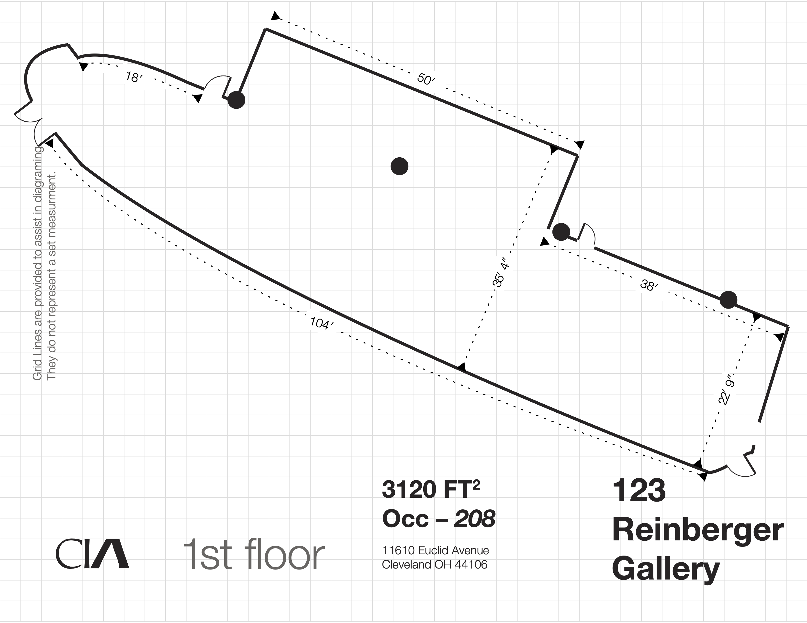
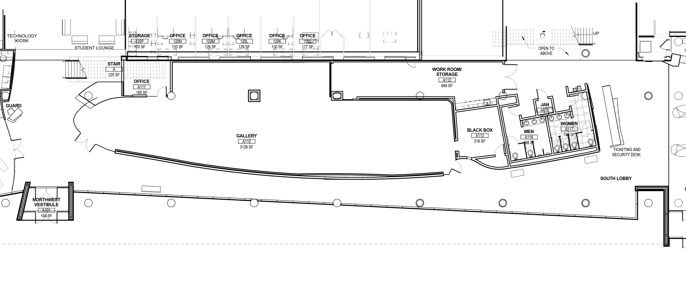

Site plans give a top down view of the overall location of structures and features of a potential sculpture, exhibition, or installation. Floor plans show the dimensions and layout of rooms inside a building or structure.

Site plans and floor plans are often drawn to scale or at least have dimensions on non scale drawings. These measurements should always be verified with reality. Never trust a site plan without at lease spot checking a few dimensions with the actual site.

<figure>

<figcaption>

Cleveland Institute of Art Reinberger Gallery Floor Plan - [Link to PDF of Floor Plan](attachments/2023-Cleveland-Institute-of-Art-Reinberger-Gallery-Floorplan-dimensions.pdf)

<figcaption>
</figure>

## Better Site Plans and Floor Plans

Sometimes the site plan or floor plan for an exhibition space is a simplified version of the actual space. This can be useful for planning the layout of 2D work on walls since the most critical factor is the width and height of the walls. Installation art and site specific work needs more detailed and accurate drawings. Often a venue will have better drawings if you ask. It may take a few attempts until you find the facilities person with the files, or the former architect that designed the building remodel, or someone from the building committee that still has a copy of the plans on their computer. While it is generally rare for a venue to have accurate .dxf files, they will often have PDF files made from the original .dxf files. These will be more accurate than a converted jpg or png floor plan.

[Link to PDF of Better Floor Plan](attachments/gallery-floor-plan-better.pdf)

## Exhibition Space Floor Plans / Site Plans

- [Red Head Gallery Floor Plan](https://www.redheadgallery.org/gallery-floor-plan)
- [1078 Gallery Floor Plan](https://www.1078gallery.org/submissions.html)
- [Walter N. Marks Center for the Arts Floor Plan](https://www.collegeofthedesert.edu/community/gallery/floor-plan.php)
- [Bellevue College Gallery Floor Plan](https://bellevuecollege.edu/galleryspace/floorplan/)
- [Richmond Art Gallery Floor Plan](https://www.richmondartgallery.org/exhibitions/gallery-floor-plan)
- [Sunshine Coast Arts Council Floor Plan](https://sunshinecoastartscouncil.com/facility-rental/floor-plan/)
- [Princeton Art Museum Floor Plans](https://artmuseum.princeton.edu/visit/museum-floor-plans)
