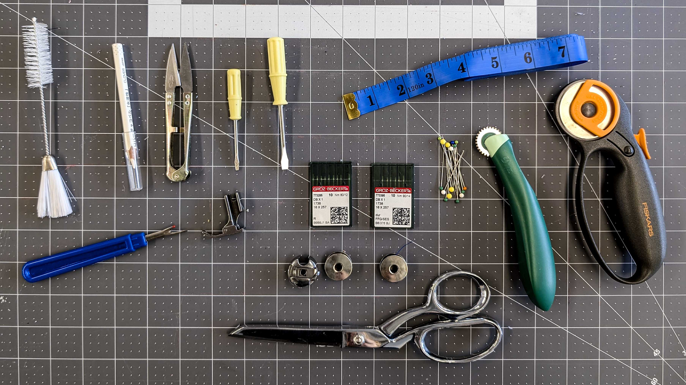

<figure>

<figcaption>

From left to right: Lint brush, water soluble pencil, thread trimmers, bobbin case screw driver, needle holder screw driver, measuring tape, seam ripper, presser foot, machine needles, ball head pins, small tooth tracing wheel, rotary cutter, bobbin case, bobbins, shears

</figcaption>
</figure>

## Basic Sewing Tools

- Shears
- Pins
- Measuring Tape
- Iron
- Needles
- Seam Ripper
- Thread Trimmer
- Rotary Cutter
- Carbon Paper Pattern Marker
- Fabric Pencil
- Thimble
- Pinking Shears
- Clear Plastic Ruler
- Blunt Edge Tracing Wheel
- Small Tooth Tracing Wheel
- Tweezers
- Pattern Paper
- Tailors Chalk

### Sewing Machine Tools

- Bobbin
- Bobbin Case
- Presser Foot
- Machine Needles
- Lint Cleaning Brush
- Bobbin Case Screw Driver
- Presser Foot Screw Driver
