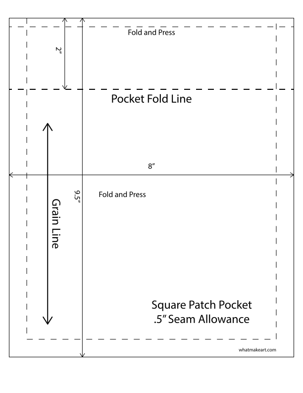

<!-- TODO Patch Pocket Video -->
<!-- TODO Square Patch Pocket Video -->
<!-- TODO Angled Patch Pocket Video -->
<!-- TODO Square Patch Flap Video -->
<!-- TODO Angled Patch Flap Video -->
<!-- TODO Patch Pocket with Zipper Video -->

- [Square Patch Pocket Template Pattern](attachments/2026-02-02-square-patch-pocket.pdf)
- [Pointed Patch Pocket Template Pattern](attachments/2024-09-00-patch-pocket-pattern.pdf)

1. Cut out fabric for patch pocket including seam allowances.
2. Finish raw edges of fabric with serger.
3. Reinforce the top part of the pocket with fusible interfacing. Attach to the wrong side of the fabric.
4. Fold the top edge of the pocket over with wrong sides to wrong sides the width of a seam allowance and press.
5. Fold the the pocket top over again at the pocket fold line with right sides to right sides and press.
6. Stitch along the seam allowance of the pocket at the top sides to keep the folded top in place.
7. Trim excess fabric and turn out the top of the pocket and press.
8. Stitch along the bottom of the top pocket hem edge.
9. Press the remaining seam allowances. You can use a stiff piece of card stock as a pressing template for consistency.
10. If the fabric is bulky trim corners before folding to reduce bulk.
11. Pin the patch pocket in place and top stitch to main piece of fabric of garment or bag.
12. Reinforce the top corners of the pocket opening by stitching back and forth multiple times to create a bartack.

## Further Reading

- [History of Pockets and Missing Pockets](history-of-pockets-&-missing-pockets.md)
