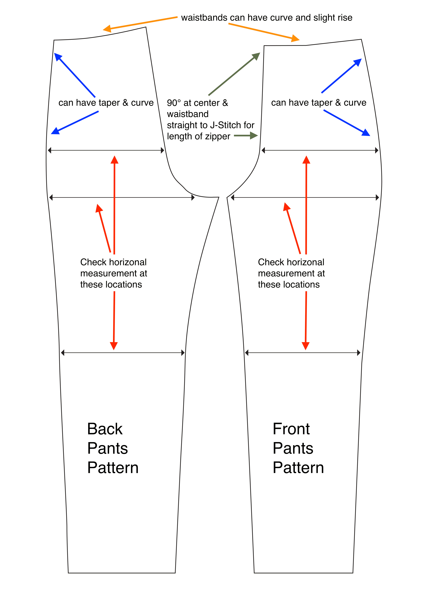

- The waistband does not need to be 100% horizontal, it can have a curve and rise
- The center-front J-stitch and center-rear J-stitch still need to be 90 degrees where it meets the waistband but does not have to be vertical.
- The out seams can have taper and curve Measure the inseam and the outseam length on the front and back pieces. They should be exactly the same, ie the inseam lengths should match and the outseam lengths should match.

