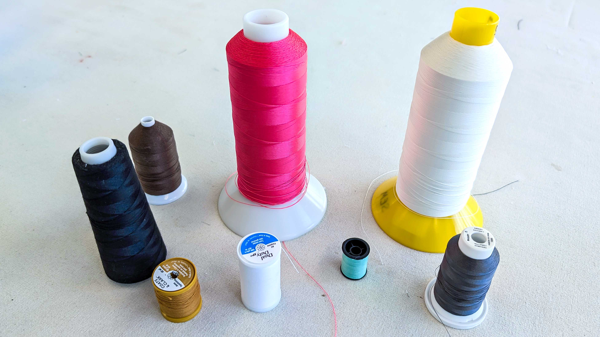

<figure>

<figcaption>

Sewing thread of different sizes.

</figcaption>

</figure>

Thread is made of lengths of yarns or filaments joined together by twisting or spinning. Thread is used in [sewing](sewing.md) to join fabric together.

### Thread Materials

Sewing thread comes in different materials and thickness.

- Cotton
- Polyester
- Nylon
- Cotton Blends
- Silk

### Thread Properties

- Multi core
- Single core
- Ply Count
- Size
- Bonded
- Spun

### Thread Sizes

Sewing thread size is determined by the weight rather than the thickness of the thread. Thread sizing systems either use a fixed weight or a fixed length. Needle size must match thread size. [How to Select Needle and Thread Size](how-to-select-needle-and-thread-size.md)

In a fixed weight system thread size is set by the length of thread needed to achieve the predetermined fixed weight. The shorter the length of thread of the same material needed to achieve the fixed weight then the the larger the thread size. It is easier and more accurate to measure the length of 1 pound of thread than to attempt to measure the diameter of an individual thread. Fixed weight systems include Gunze Count, Weight (Wt.), English Cotton Count (ECC or Ne or NeC), the Metric Count (Nm), and Silk machine twist sizes.

In a fixed length system all threads are cut to the same length and then weighed. It is easier and more accurate to weigh a 1,000 meters of thread than to precisely measure the tiny diameter of thread that can deform and compress. Since the length used to weigh thread stays the same, if one thread weighs more than another thread of the same material, the heavier thread will be thicker or a bigger size. Fixed length systems include, Tex, Denier Count (Den), dTex, and Commercial Sizes.

Use the Tex sizing system unless you have a specific reason not to. Always compare thread sizes of the same material. A Tex 30 polyester thread will be different than a Tex 30 cotton thread.

| Thread Size System                      | Measurement                                                 |
| --------------------------------------- | ----------------------------------------------------------- |
| Tex                                     | Grams per 1,000 meters of thread                            |
| Denier (Den)                            | Grams per 9,000 meters of thread                            |
| dTex                                    | Grams per 10,000 meters of thread                           |
| English Cotton Count (ECC or Ne or NeC) | How many 840 yard lengths of thread per pound               |
| Metric Count (Nm)                       | How many 1,000 meter lengths of thread per kilogram         |
| Commercial Size                         | Denier divided by 10                                        |
| Gunze Count                             | Length of thread required to weigh 1 kilogram in kilometers |
| Weight (Wt.)                            | Gunze Count without specifying number of plies              |

#### Number of Plies in Thread

Thread can have a different number of strands or plies twisted together. A single ply thread has one strand while a 2 ply thread has 2 strands and a 3 ply thread has 3 strands. The number of plies is often listed as a digit after the thread size for example 30-2 indicates a thread of two size 30 yarns spun together. If using a fixed weight thread sizing system it is important to indicate the number of plies since two threads of the weight but with a different number of plies would be a different size. 30/2 is not the same as 30/3.

#### Thread Ticketing Systems

In addition to different thread sizing systems, there are also specific manufacturing ticketing systems for thread. Generally a lower ticket number indicates a thicker thread.

### Thread Size Conversions

| From   | To     | Formula       |
| ------ | ------ | ------------- |
| Weight | Denier | 9000 / weight |
| Weight | Tex    | 1000 / weight |
| Denier | Weight | 9000 / Denier |
| Denier | Tex    | Denier / 9    |
| Tex    | Denier | Tex x 9       |
| Tex    | Weight | 1000 / Tex    |

