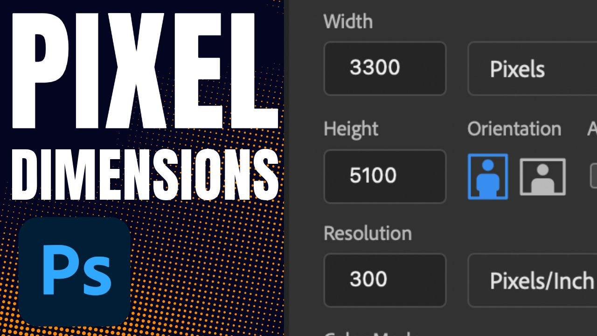

<iframe class="youTubeIframe" src="https://www.youtube.com/embed/WZr5oklcKAw?rel=0" width="560" height="315" frameborder="0" allow="accelerometer; autoplay; clipboard-write; encrypted-media; gyroscope; picture-in-picture; web-share" referrerpolicy="strict-origin-when-cross-origin" allowfullscreen></iframe>

[Set Pixel Dimensions in a New Document in Photoshop](https://youtu.be/WZr5oklcKAw)

