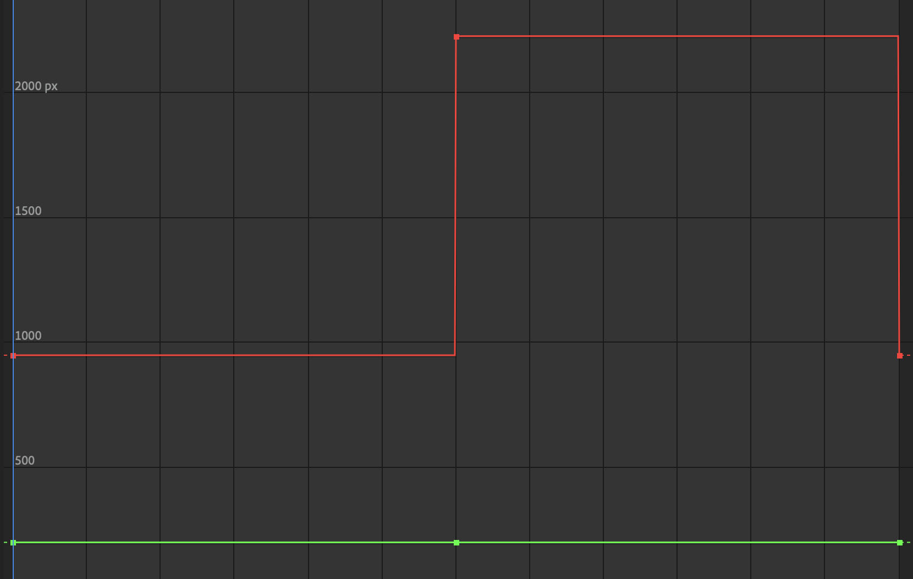
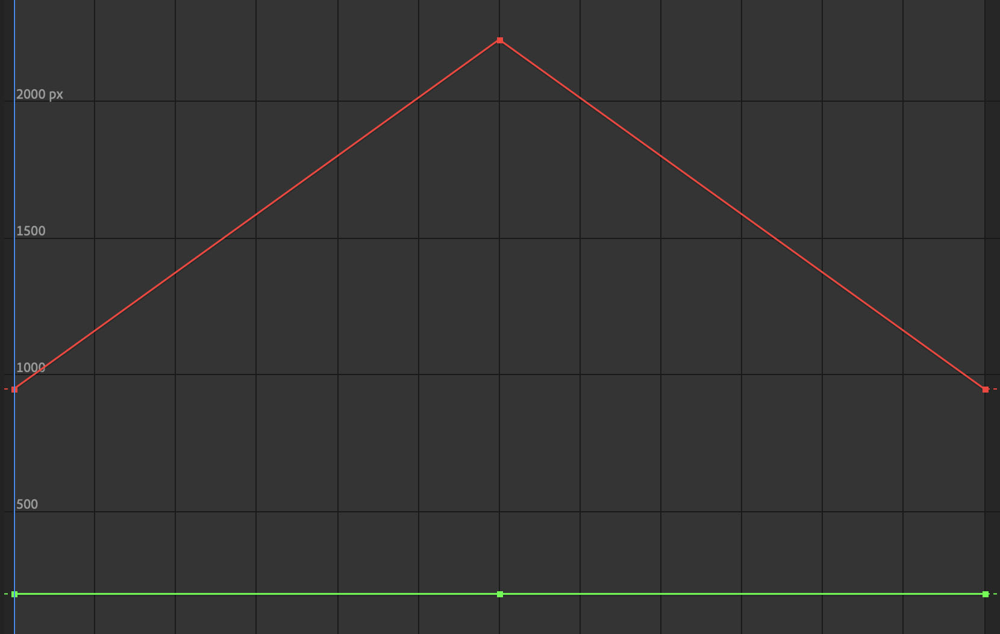
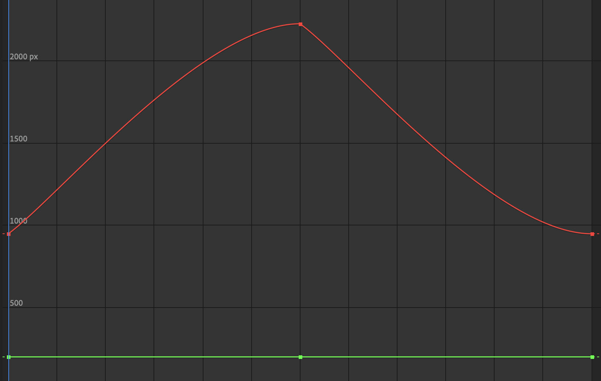
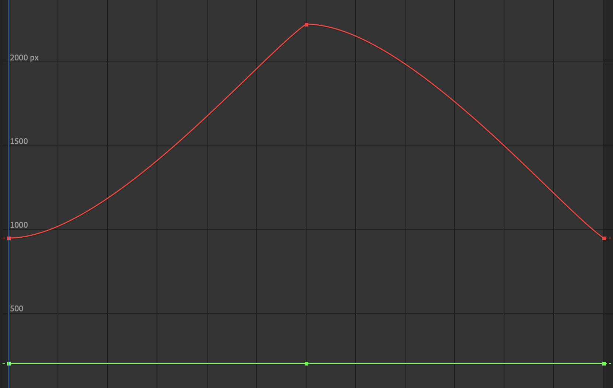
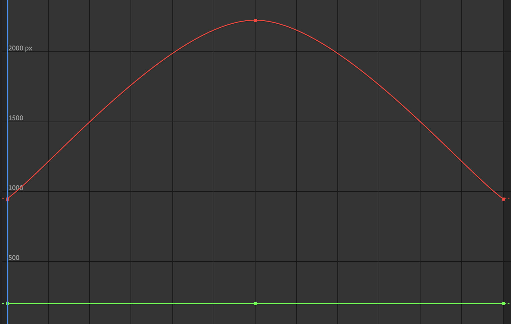
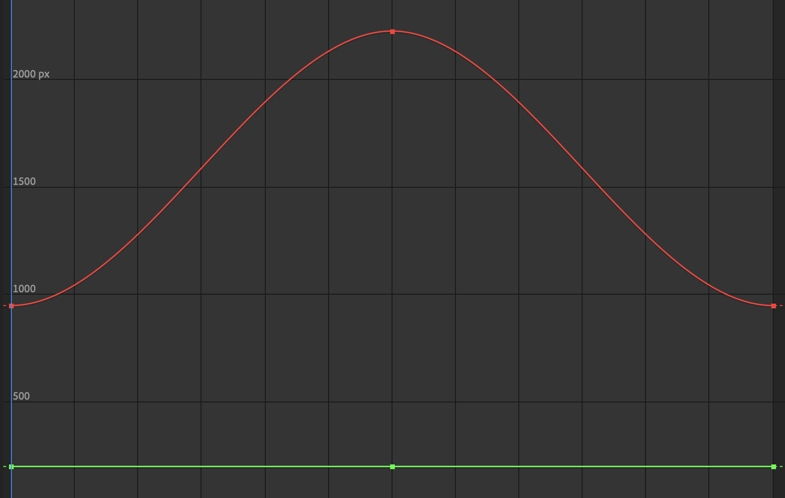

Keyframes define the value of an attribute at a specific point in time. That attribute could be position, scale, rotation, opacity, color, or many other parameters depending on the software being used.

A single keyframe by itself does not create visible motion. Animation happens when a second keyframe is added later on the timeline with a different value for the same attribute. The software then calculates the transition between those two values. This process is often called **tweening** or **interpolation**.

The distance between keyframes on the timeline affects the speed of the change. If two keyframes are close together, the change happens quickly. If they are farther apart, the change happens more slowly. The way that motion progresses between keyframes is determined by the **interpolation type**.

## Keyframe Interpolation

Interpolation describes how animation moves from one keyframe to the next. Different interpolation types change the feeling of motion and can make an animation appear mechanical, smooth, abrupt, or more natural.

- **Step**  
  Also called **hold** interpolation. The value does not gradually change between keyframes. Instead, it stays fixed until the next keyframe is reached, where it jumps instantly to the new value. This is useful for stop-motion effects, blocked animation, or sudden changes.

- **Linear**  
  The value changes at a constant rate from one keyframe to the next. This creates even motion, but it can sometimes look stiff or unnatural because real objects usually accelerate and decelerate.

- **Ease In**  
  The motion starts slowly and then speeds up as it approaches the next keyframe. This can help suggest acceleration.

- **Ease Out**  
  The motion starts quickly and then slows down as it approaches the next keyframe. This can help suggest deceleration.

- **Bezier**  
  Bezier interpolation allows the animator to shape the motion curve more precisely using handles in a graph editor. This gives greater control over acceleration, deceleration, and more complex motion.

<figure>

<figcaption>

Step or Hold Keyframes

</figcaption>
</figure>

<figure>

<figcaption>

Linear Keyframes

</figcaption>
</figure>

<figure>

<figcaption>

All Ease In Keyframes

</figcaption>
</figure>

<figure>

<figcaption>

All Ease Out Keyframes

</figcaption>
</figure>

<figure>

<figcaption>

Ease In then Ease Out Keyframes

</figcaption>
</figure>

<figure>

<figcaption>

Ease Out then Ease In Keyframes

</figcaption>
</figure>

## Keyframe Graph Editor

Graph editors in programs such as [After Effects](../video/after-effects/after-effects.md), [Maya](../3d-modeling/maya/maya.md), and [Blender](../3d-modeling/blender/blender.md) allow animators to fine-tune the interpolation of keyframes.

On a standard timeline, you can usually move keyframes in time and choose a basic interpolation type. In a graph editor, you can directly shape the motion curve. This makes it possible to create more subtle and expressive movement, including overshooting a value, bouncing past a target, or gradually settling into place.

In these graphs:

- the **X-axis** represents time
- the **Y-axis** represents the value of the animated attribute

A straight line usually indicates constant motion, while a curved line indicates changing speed. Steeper curves represent faster value changes, while flatter curves represent slower changes.

<figure>

<figcaption>

Hold Keyframe Graph

</figcaption>
</figure>

<figure>

<figcaption>

Linear Keyframe Graph

</figcaption>
</figure>

<figure>

<figcaption>

All Ease In Keyframe Graph

</figcaption>
</figure>

<figure>

<figcaption>

All Ease Out Keyframe Graph

</figcaption>
</figure>

<figure>

<figcaption>

Ease In then Ease Out Keyframe Graph

</figcaption>
</figure>

<figure>

<figcaption>

Ease Out then Ease In Keyframe Graph

</figcaption>
</figure>

## Why Keyframes Matter

Keyframes are one of the most fundamental concepts in animation, motion graphics, and visual effects. They allow animators to control change over time in a structured way. Rather than defining every single frame manually, an animator can define important moments and let the software calculate the in-between motion.

This makes keyframes useful not only for character animation, but also for:

- moving cameras
- animating lights
- changing material properties
- controlling text and graphics
- adjusting simulation settings
- creating interface and motion design effects

Learning how to place keyframes well and adjust their interpolation is essential for creating motion that feels clear, intentional, and expressive.

## Examples of Keyframe Use

- [maya-3d-animation](../3d-modeling/maya/3d-animation-maya.md)
- [animation](animation.md)
- [blender-3d-animation](../3d-modeling/blender/3d-animation-blender.md)
