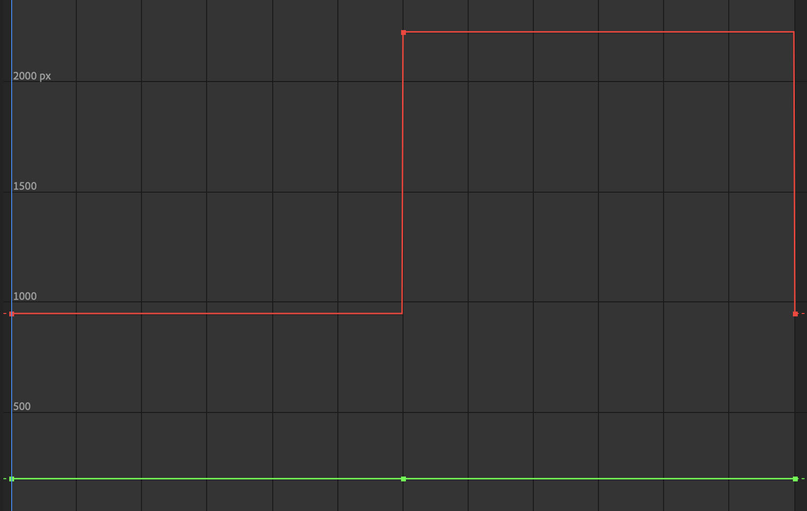
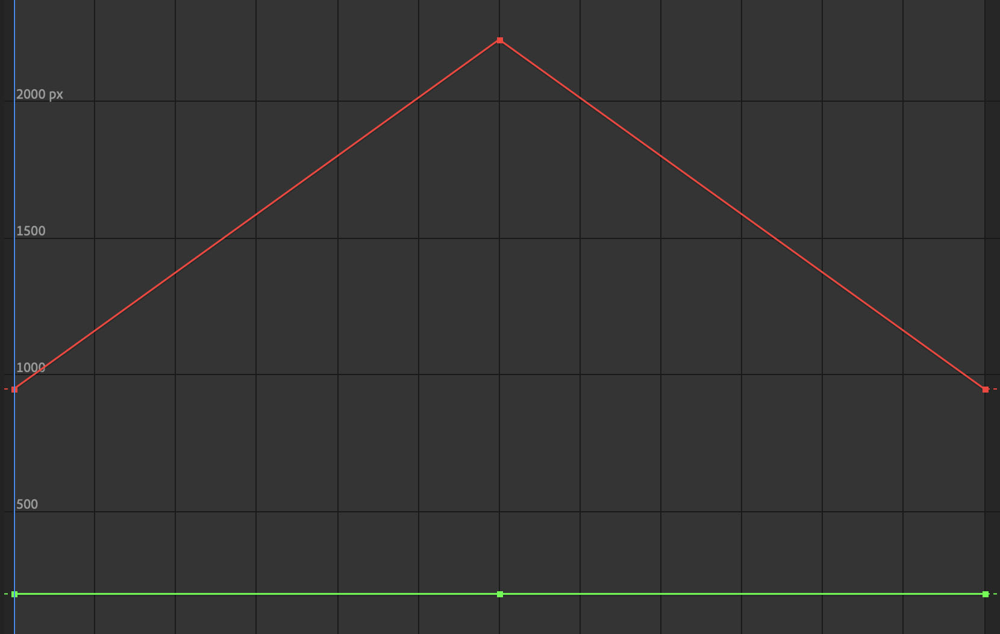
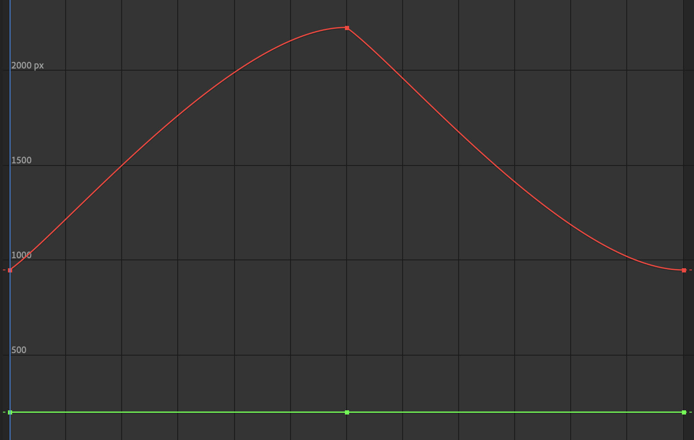
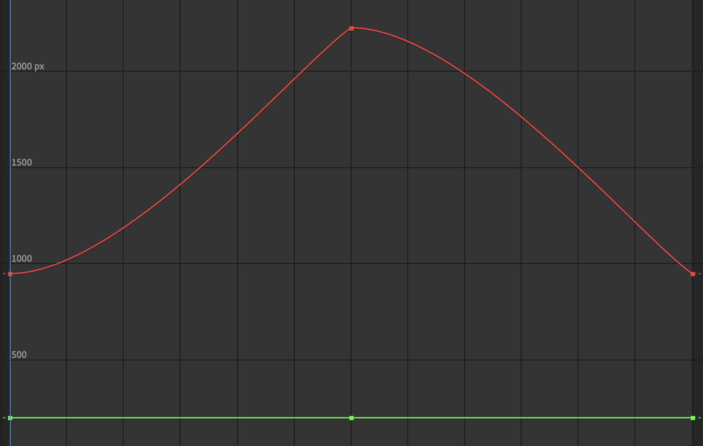
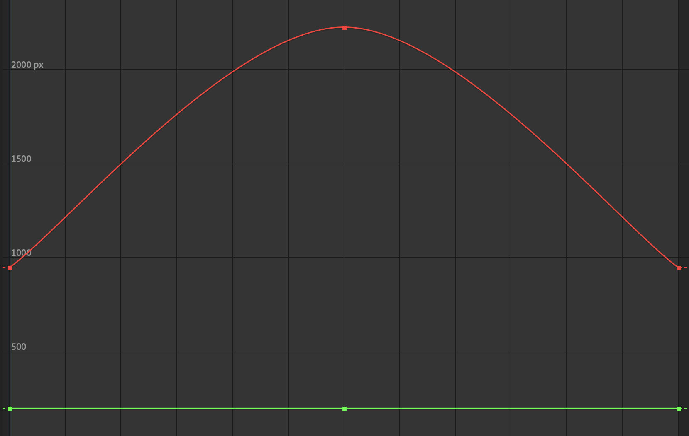
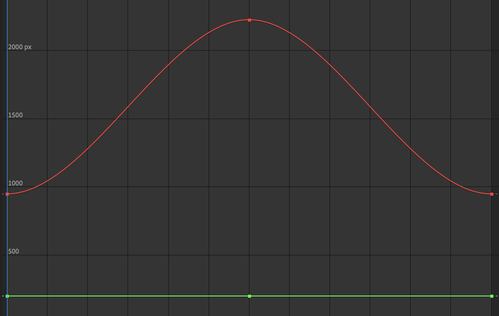

Keyframes describe an attribute at a point in time. This could be position, scale, rotation, opacity or many other parameters. With only a single keyframe, nothing happens. If a second keyframe is set at a different point in time and has a different value for that same attribute as the first keyframe, then software can "tween" or animate the transition from one keyframe value to another keyframe value.

How far apart the keyframes are on the timeline determines the speed of the change. This can also be changed by changing the type of the keyframe to influence its interpolation.

## Keyframe Interpolation

- Step
- Linear
- Ease In
- Ease Out
- Bezier

<figure>

<figcaption>

Step or Hold Keyframes

</figcaption>
</figure>
<figure>

<figcaption>

Linear Key Frames

</figcaption>
</figure>

<figure>

<figcaption>

All Ease In Key Frames

</figcaption>
</figure>

<figure>

<figcaption>

All Ease Out Key Frames

</figcaption>
</figure>

<figure>

<figcaption>

Ease In then Ease Out Key Frames

</figcaption>
</figure>

<figure>

<figcaption>

Ease Out then Ease In Key Frames

</figcaption>
</figure>

## Keyframe Graph Editor

Graph editors in programs like [After Effects](../video/after-effects/after-effects.md), [Maya](../3d-modeling/maya/maya.md), [Blender](../3d-modeling/blender/blender.md) and other animation and motion graphics software, allow you to fin tune the interpolation of keyframes. On a standard timeline you can change the frame of the keyframe and its basic interpolation but with the graph editor more complex interpolations, including "overshooting" the keyframe value are possible.

In the graphs the X axis show time and the Y axis shows the value of the parameter being animated.

<figure>

<figcaption>

Hold Keyframe Graph

</figcaption>
</figure>

<figure>

<figcaption>

Linear Keyframe Graph

</figcaption>
</figure>

<figure>

<figcaption>

All Ease In Keyframe Graph

</figcaption>
</figure>

<figure>

<figcaption>

All Ease Out Keyframe Graph

</figcaption>
</figure>

<figure>

<figcaption>

Ease In then Ease Out Keyframe Graph

</figcaption>
</figure>

<figure>

<figcaption>

Ease Out thn Ease In Keyframe Graph

</figcaption>
</figure>

## Examples of Keyframe Use

- [maya-3d-animation](../3d-modeling/maya/3d-animation-maya.md)
- [animation](./animation.md)
- [blender-3d-animation](../3d-modeling/blender/3d-animation-blender.md)
