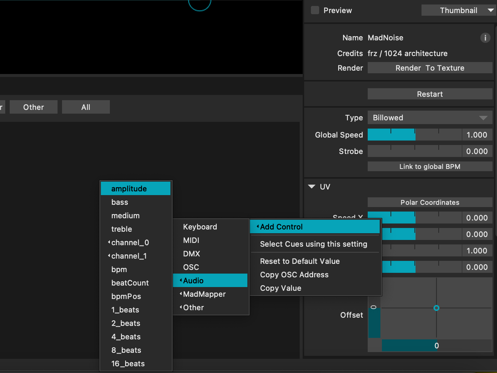
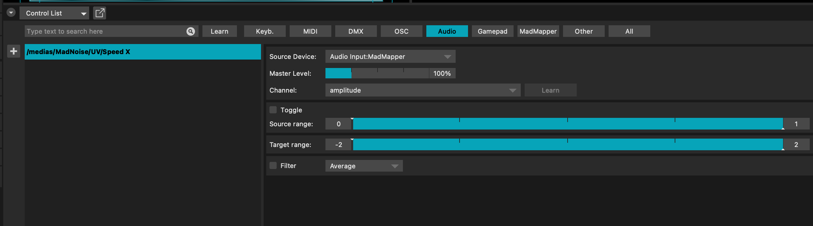

## Madmapper React to Audio Track

For Madmapper to react to a track in the Audio Player module, the audio input in Madmapper preferences needs to be changed. To add a control to a specific parameter of an effect in Maddmapper, right click on the parameter in the effect on the right of the screen and select add control. Then you can select which type of control.

Then the new control you created will appear in the control list. This will show what it is controlling as well as allow you to edit the sensitivity and output. Filters can also be applied.

