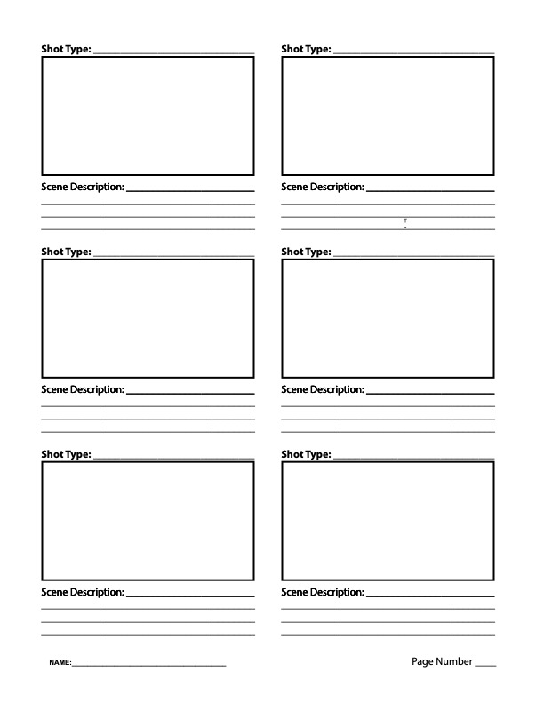

It is a good idea to make simple storyboards for your animation. Since animation can be time consuming, it is best to know what you plan to animate before you start. For a 30 second animation you need a minimum of 15 storyboard panels if each panel represents 2 seconds of animation. The actual number needed will vary based on the type of narrative and project that is animated. Remember, when drawing a storyboard, change the camera angle and distance from the camera for each shot / scene / animation.

You can print out the [template](storyboard-template.pdf) on this page. Write down the type of shot on each panel. Write a brief description of what is happening. Think of each panel as representing 2-3 seconds of animation. Plan accordingly so you do not have too much action or too little action.

