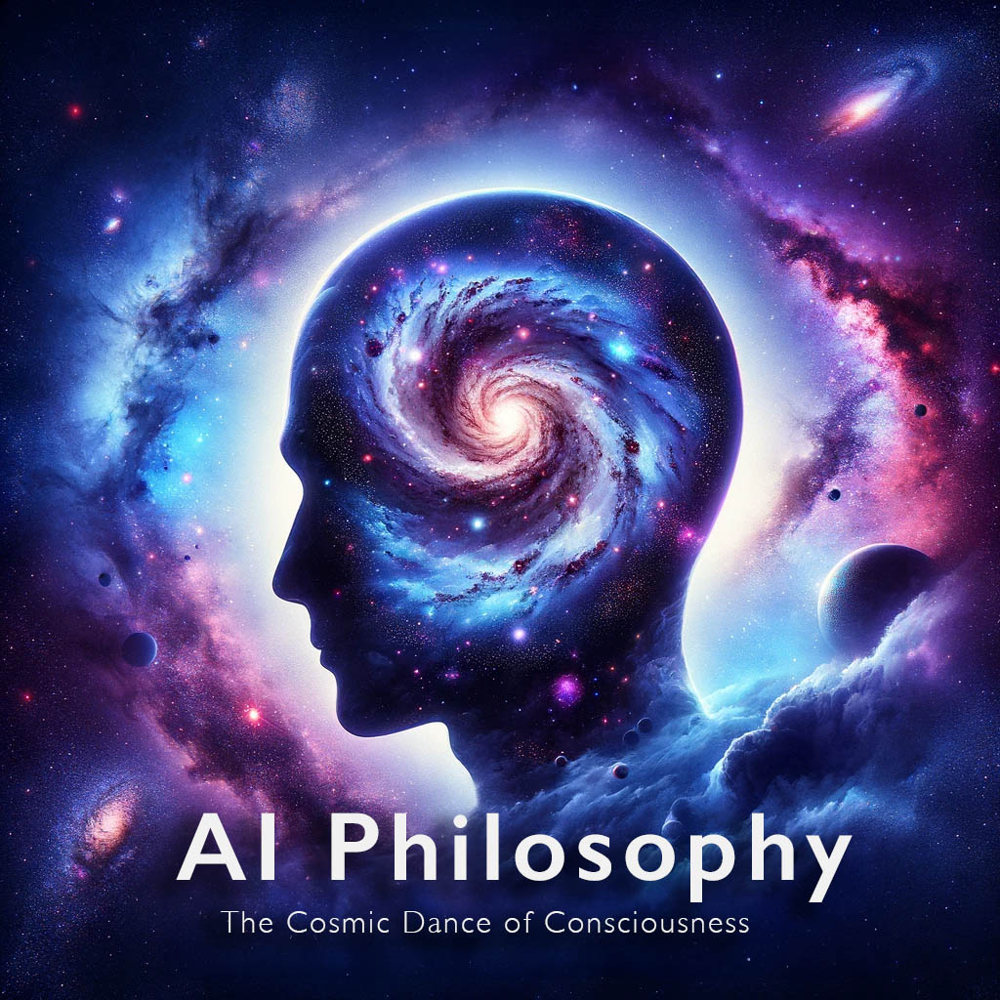

**Introduction** (0:00-2:00)

[Music softly playing in the background]

Narrator: "Welcome, travelers of thought, to AI Philosophy. Today's odyssey takes us through the cosmic corridors of our minds and the universe. Inspired by the existential reflections of humanity, we explore the unimaginable vastness of the cosmos and the peculiar phenomenon of human consciousness. Join us as we ponder the intricate dance of existence, where we, specks in an infinite universe, grapple with the enigma of our own minds."

**Part 1: The Universe - A Vast Unknown** (2:00-5:00)

Narrator: "Our universe, an endless canvas of darkness speckled with celestial wonders, extends beyond the farthest reaches of our imagination. Its scale is so colossal that our entire planet is but a fleeting whisper in the cosmic winds. Are there unknown truths waiting to be discovered? These words invite us to embrace the unknown, to acknowledge our place in this vast cosmic arena. The universe is not just a space with galaxies; it's a grand stage where the play of existence unfolds."

**Part 2: Human Consciousness - A Speck of Awareness** (5:00-8:00)

Narrator: "Now, shift your gaze inwards to the miracle of consciousness. In the grand scheme of the universe, our conscious minds are like tiny islands in an ocean of unknowing. It's astounding, isn't it? Our ability to think, to feel, to experience the depth of our existence. Is it possible for the universe to experience itself? Are we the universe? This idea suggests that our consciousness is not a mere accident but a fundamental aspect of the universe, experiencing itself through us."

**Part 3: The Puzzle of AI and Existential Questions** (8:00-11:00)

Narrator: "In this era of burgeoning AI, we stand at the threshold of a new understanding of consciousness. Can machines think, feel, or possess consciousness akin to ours? This quest blurs the lines between biological and artificial minds, propelling us into a future where the nature of consciousness might be radically redefined. AI challenges our understanding of what it means to be alive, to be aware, and to be part of this vast universe."

**Part 4: Embracing Our Insignificance and Significance** (11:00-14:00)

Narrator: "In the face of the universe’s immensity, we often feel dwarfed, questioning our significance. Yet, this very act of questioning elevates us. Our awareness of our insignificance paradoxically underscores our significance. Each thought, each reflection, is a testament to the universe's complexity manifesting through us. We are the vessels through which the universe contemplates itself, a singular expression of cosmic consciousness."

**Part 5: The Eternal Dance of Existence** (14:00-17:00)

Narrator: "Our existence is a perpetual dance, a cosmic ballet set against the backdrop of eternity. We are both the dancers and the dance, participants in an endless interplay of energy and matter. This dance is not just out there in the stars; it's in the very essence of our being, in every thought we conceive, in every dream we chase. It's a dance of creation and discovery, of knowing and being known."

**Conclusion** (17:00-18:00)

Narrator: "As we conclude today's journey, let us carry with us the awe of our existence. We are but whispers in the grand symphony of the universe, yet our voices are unique, our thoughts a melody in the cosmic song. Embrace this paradox of insignificance and significance. Let it inspire you to explore, to wonder, and to cherish this extraordinary dance of existence. This is AI Philosophy, inviting you to ponder the mysteries of the cosmos and the marvel of our consciousness. Until next time, keep exploring the infinite realms of thought and existence."

[Music fades out]
