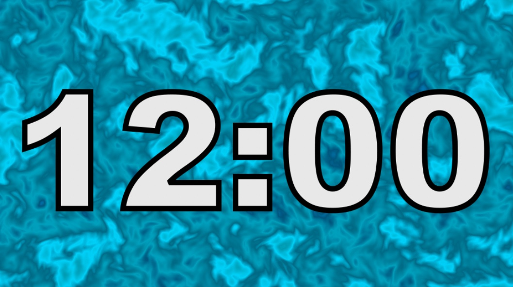

<iframe class="youTubeIframe" width="560" height="315" src="https://www.youtube.com/embed/NS-_N1cBg8Y" title="YouTube video player" frameborder="0" allow="accelerometer; autoplay; clipboard-write; encrypted-media; gyroscope; picture-in-picture; web-share" referrerpolicy="strict-origin-when-cross-origin" allowfullscreen></iframe>

## Introduction:

In today's fast-paced world, keeping track of time is crucial, especially during presentations, meetings, or while creating engaging video content. That's where our latest YouTube offering comes into play—a captivating [12-minute countdown timer](https://youtu.be/NS-_N1cBg8Y) set against an aesthetically pleasing abstract animated background. This unique combination of functionality and style is not just a timer; it's a game-changer for your content delivery.

## Why Use a Countdown Timer?

- **Time Management:** In any time-bound scenario, be it a workshop, a meeting, or a segment in a video, managing time efficiently is key. Our 12-minute countdown timer acts as a subtle reminder, helping you and your audience stay on track.
- **Audience Engagement:** A countdown timer isn’t just about watching seconds tick away. With its visually attractive abstract background, it keeps your audience engaged, adding a creative touch to the usual monotonous ticking.

## The Aesthetics of Abstract Animation

- **Visual Appeal:** The timer features a background that isn’t just abstract—it’s a piece of moving art. Its fluid, colorful patterns are designed to captivate and hold the attention of viewers, making your content more memorable.
- **Setting the Right Tone:** Whether you’re aiming for a professional demeanor or a more relaxed vibe, the timer’s background can be interpreted in various ways, setting the appropriate mood for your content.

## Versatility of the Timer

- **Diverse Use Cases:** From being a great tool during exercise sessions to acting as a productive pomodoro timer for your work sessions, its uses are manifold. It’s also perfect for adding a professional touch to your live streams or YouTube videos.
- **Customization Options:** While this version is set for 12 minutes, we’re open to creating customized timers that fit your specific needs. Let us know your requirements!

Technical Aspects and Ease of Use

- **Compatibility:** This timer is designed to be compatible across various platforms and video formats, ensuring you can use it wherever you need it.
- **User-Friendly:** We’ve ensured that integrating this timer into your projects is as easy as possible. No complicated setups, just straightforward utility.

## How to Access and Use the Timer

- **Step-by-Step Guide:** To use this timer, simply visit the link provided at the end of this post. You can then embed or play it as part of your presentations or videos.
- **Link to the Video:** [Click here](https://youtu.be/NS-_N1cBg8Y)to watch and use our 12-minute countdown timer.

Our 12-minute countdown timer with an abstract animated background is more than just a timekeeping tool; it's an enhancement to your content delivery and engagement strategy. Give it a try in your next presentation, video project, or time-management task, and see the difference it makes.

Don't forget to watch the video and use this unique timer to bring a new dimension to your content. Subscribe for more creative tools and share this with your network to help others discover this useful resource.

