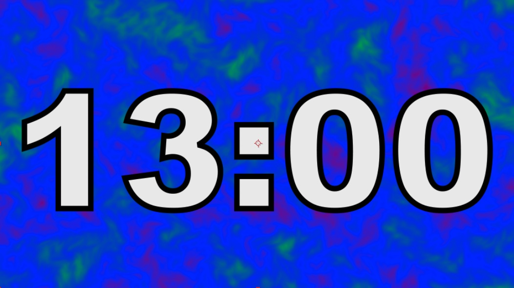

<iframe class="youTubeIframe" width="560" height="315" src="https://www.youtube.com/embed/7Vfls3dJLZI" title="13 Minute Timer" frameborder="0" allow="accelerometer; autoplay; clipboard-write; encrypted-media; gyroscope; picture-in-picture; web-share" referrerpolicy="strict-origin-when-cross-origin" allowfullscreen></iframe>

This video features a [13 minute countdown timer](https://youtu.be/7Vfls3dJLZI) with an abstract animated background. The timer is perfect for use in presentations, videos, or any other situation where you need to keep track of time. The abstract animated background adds a touch of style and sophistication to the timer, making it a great choice for any project.

## Features:

- 13 minute countdown timer
- Abstract animated background
- High quality video and audio
- Easy to use

## Benefits:

- Keep track of time
- Add a touch of style and sophistication to your projects
- Perfect for presentations, videos, and more

