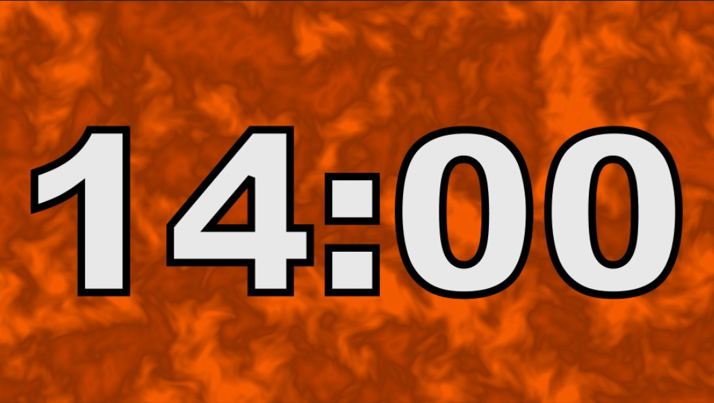

<iframe class="youTubeIframe" width="560" height="315" src="https://www.youtube.com/embed/gnk3l9uQUwc" title="14 Minute Timer" frameborder="0" allow="accelerometer; autoplay; clipboard-write; encrypted-media; gyroscope; picture-in-picture; web-share" allowfullscreen></iframe>

This [14-minute timer](https://youtu.be/gnk3l9uQUwc) features an abstract animated background that is perfect for focusing and staying on track. The timer is easy to use and can be customized to fit your needs. Simply click the start button and the timer will begin counting down. When the timer reaches zero, it will play a sound to alert you.

This timer is perfect for a variety of activities, including:

- Studying
- Working
- Meditating
- Practicing yoga
- Taking a break

The timer is also great for kids and can be used to help them with tasks such as:

- Homework
- Chores
- Getting ready for bed

This timer is a great way to stay focused and productive. It is easy to use and features a beautiful abstract animated background. Try it today and see how it can help you reach your goals.

