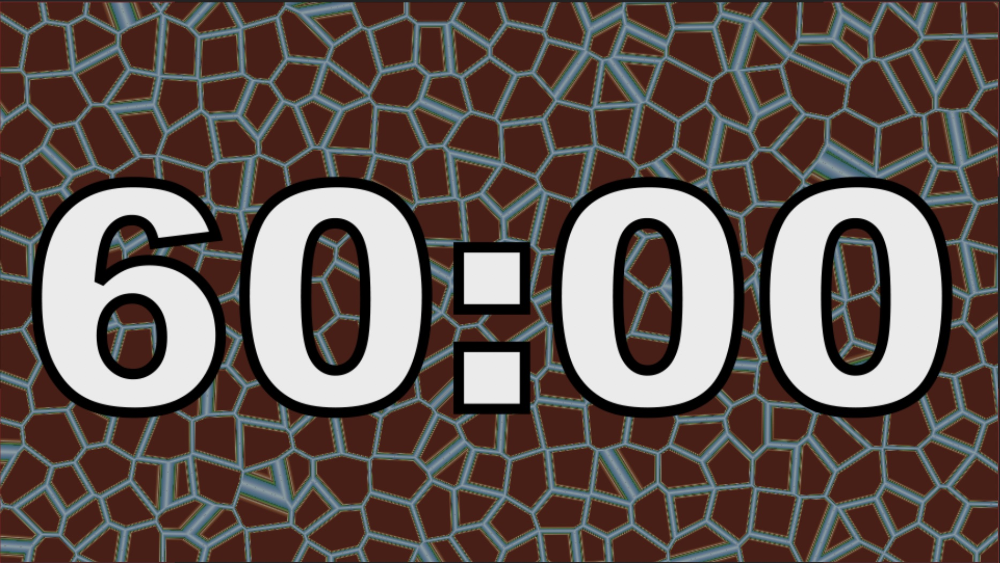

<iframe class="youTubeIframe" width="560" height="315" src="https://www.youtube.com/embed/LISF5q2Xmsw" title="60 Minute Timer" frameborder="0" allow="accelerometer; autoplay; clipboard-write; encrypted-media; gyroscope; picture-in-picture; web-share" referrerpolicy="strict-origin-when-cross-origin" allowfullscreen></iframe>

In today’s fast-paced educational landscape, maintaining focus can be challenging. Whether you’re a teacher orchestrating a classroom activity or a student delving into intense study sessions, a timer can be your best ally for productivity. This is where the unique "60 Minute Countdown Timer in 4K 60fps with Looping Background Animation" comes into play, offering an innovative solution to time management.

## The Importance of Timed Focus

Timing is essential in creating a structured learning environment. Research indicates that timed sessions significantly enhance concentration and productivity. A specific duration, like 60 minutes, sets clear boundaries, allowing learners and educators to focus on the task without the distraction of clock-watching.

## Features of the 60-Minute Countdown Timer

This isn’t just any timer. Its 60-minute countdown is displayed in a crisp 4K resolution, ensuring clarity and visibility from every corner of the classroom. Running at 60 frames per second, the timer provides a smooth, seamless visual experience. What sets it apart is its looping background animation – a subtle yet engaging visual that keeps the mind focused without being distracting. And importantly, it operates silently, making it perfect for study environments and classrooms where concentration is key.

## How to Use the Timer Effectively

Integrating this timer into your routine can revolutionize how you manage time. For students, use it to break your study sessions into focused, one-hour chunks. Educators can utilize it during exams, group activities, or timed assignments, providing students with a clear visual cue of the time remaining.

## Technical Aspects and Accessibility

The 4K 60fps specification isn’t just technical jargon. It means that the timer is not only clear and easy to read but also gentle on the eyes, which is crucial during long study sessions. This timer is easily accessible on various devices and platforms, ensuring that no matter where you are, you can benefit from this tool.

Whether you're a student aiming for academic excellence or a teacher fostering an efficient learning environment, this 60-minute countdown timer is an invaluable tool. Give it a try in your next study session or classroom activity and experience the difference it makes. And don't forget to visit the YouTube channel for more resources that can aid in your educational journey.

